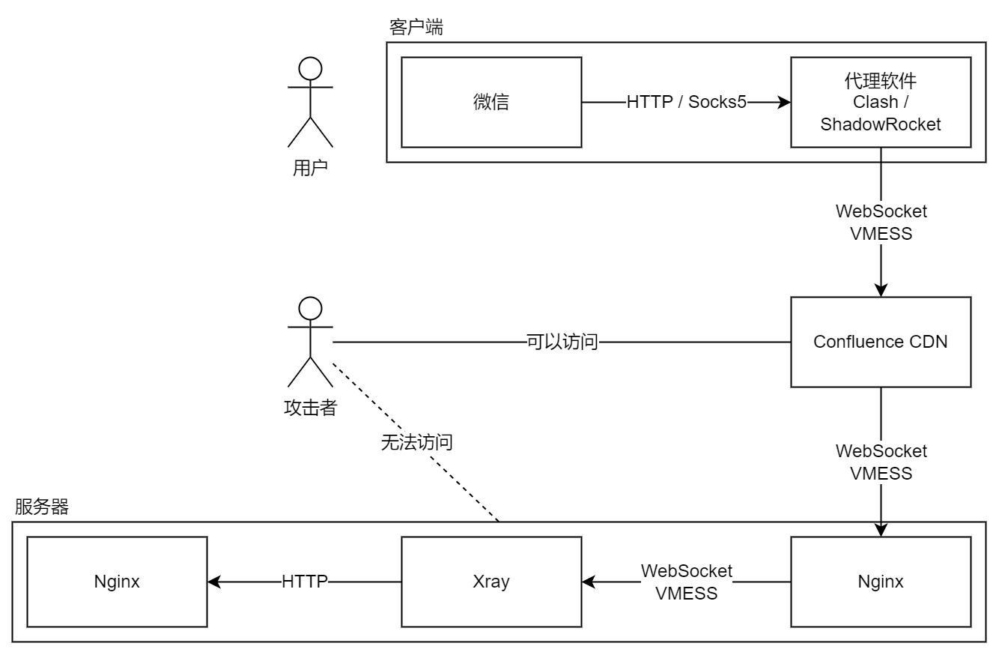

# 实现原理

通过这篇文档，您将了解 SCUT.life 如何实现替换微信内部 MyPass.

## 前情提要

MyPass 是本质是一个网页，它的域名是 enroll.scut.edu.cn，它的主页是 https://enroll.scut.edu.cn/door/index_h5.html. 要想在微信中用我们制作的 MyPass 替换原来的，只需要让微信尝试访问上述地址时，跳转到我们自己架设的服务器，而非官方的服务器。

### DNS 查询

当微信尝试访问 enroll.scut.edu.cn 时，它会向 DNS 服务器发起（为了简化解释，这里略去了 DNS 的分级概念）对于这个域名的 A 记录查询。这时 DNS 服务器会返回 IP 地址 202.38.251.29，微信收到后就会按照这个地址向 MyPass 的服务器发起 HTTP 请求。

### SSL/TLS

纯 HTTP 是明文传输的，这相当不安全。在 HTTP 中加上 SSL/TLS 后就能得到 HTTPS，它采用加密的方式传输信息，网络的中间商在没有密钥的情况下无法解密数据。TLS 证书的验证有一套信任机制用来防止中间人攻击，当权威的证书颁发机构（CA, Certificate Authority）生成 CA 证书和私钥后，CA 机构会保管好私钥，设备需要安装证书，此后由这张 CA 证书和私钥签发的子证书都会被设备信任。CA 只会给域名的所有者签发子证书，我们没有 enroll.scut.edu.cn 的所有权，因此并不会获得子证书。

## 域名劫持

### hosts 劫持

倘若我们有一台安装盗版 MyPass 的服务器地址为 A.B.C.D，如果我们让 enroll.scut.edu.cn 的 DNS 查询结果变成 A.B.C.D，那么微信就会以为 MyPass 的地址是 A.B.C.D，从而向它发起 HTTP 请求。上述操作可以称为“DNS劫持”。在 Windows 和 Linux 设备上，可以通过修改 hosts 文件轻松完成上述操作；在 Android、iOS 或 iPadOS 上，也可以通过 Clash 或 ShadowRocket 产生类似 hosts 的功能。但是这样的劫持会产生一个漏洞，第三方可以通过暴露的 IP 地址定位到这台服务器。如果第三方与云服务商有合作，或许可以通过联系云服务商拿到注册者的个人信息。因此，上述实现方法被排除了。

### 代理劫持

另外一种劫持的方式是代理。当浏览器或操作系统配置好代理后，任何发送或接收的流量都会经过代理服务器，而代理服务器可以趁机将 enroll.scut.edu.cn 的请求转发到我们设计的服务器。我们在云服务器上安装 Xray，将出口设置为 127.0.0.1，并在本机安装 Nginx 响应寻找 enroll.scut.edu.cn 的请求；在入口处使用 VMESS 协议，客户端通过支持 VMESS 协议的代理软件，设置好服务器地址后连接服务器并被劫持。这样的方案仍然存在上述 IP 地址暴露的漏洞。

## 防追踪

如果在客户端与服务器之间加一层屏障，客户端只与屏障连接，屏障再和服务器连接，就能防止服务器 IP 地址的暴露。于是 Cloudflare CDN 就出现了，它很好地解决了源服务器地址暴露的问题，为全世界防御 DDoS 攻击做出来卓越的贡献。我们可以将 VMESS 的流量伪装成 WebSocket 流量，Cloudflare 可以转发 WebSocket 的内容，于是客户端就无法追踪代理服务器的真实地址。经过 Cloudflare 转发需要一个域名，我们使用 freedom.scut.life 完成这个功能。Cloudflare 在国内有服务器，我们的源服务器也在国内，因此这套服务并没有非法架设跨境信道。

## 信任机制

完成上述操作后，您已经可以在浏览器中正常打开被劫持后的 MyPass，但无法在微信中打开。微信强制要求校验 HTTPS 证书，我们并没有 enroll.scut.edu.cn 这个域名的所有权，自然无法从 CA 那里获取 TLS 证书形成 HTTPS。

除了权威的 CA 可以签发 TLS 证书，个人可以自建 CA 后产生自签名的 TLS 证书。这类证书通常不会被信任，在浏览网页时会被浏览器报出“HTTPS 不安全”的警告，但如果我们手动信任自签发的 CA 证书，微信和浏览器就会信任这个请求。至此，我们骗过了微信，并在微信中显示了我们修改过的 MyPass.

## 流程图

