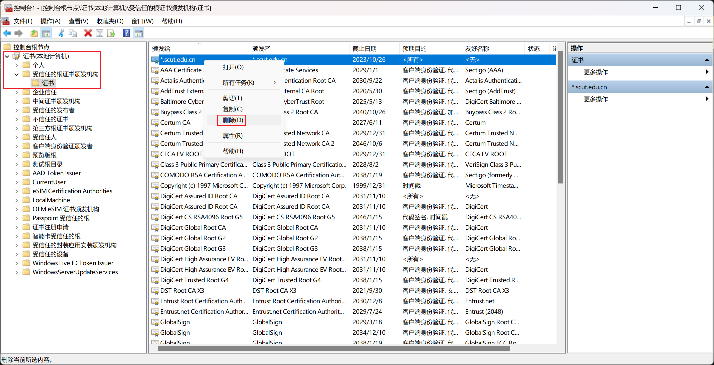

# 卸载证书

::: warning 警告

误删证书可能会导致系统无法正常联网，请注意不要删除系统自带的证书。

:::

::: tip 提示

卸载证书后，您将无法继续使用 SCUT.life 的服务。

:::

## Windows

1. 按下快捷键 Windows + R，打开“运行”
2. 输入“mmc”，并按下“确定”
3. 点击菜单栏左上角 文件—添加/删除管理单元
4. 在左侧找到“证书”并双击打开
5. 选择“计算机账户”，并点击下一页，点击完成
6. 点击确定
7. 在左侧目录依次点击 证书（本地计算机）—受信任的根证书颁发机构—证书
8. 在右侧找到本站签发的证书（旧版证书的名称是 *.scut.edu.cn）
9. 右键证书并删除



## Linux

以 Ubuntu 为例

请删除 /usr/local/share/ca-certificates/ 路径下本站签发的证书

``` bash
sudo rm /usr/local/share/ca-certificates/scut.edu.cn_ca.cer
sudo sudo update-ca-certificates
```

## Android

1. 打开系统设置

2. 点击“安全”选项卡（不同系统的手机其名称可能略有不同）

3. 点击“加密与凭据”

4. 点击“信任的凭据”

5. 切换到“用户”选项卡

6. 点击本站签发的证书

7. 点击“删除”并确定

## iOS / iPadOS

1. 打开设置
2. 找到 通用—VPN与设备管理
3. 找到本站的描述文件
4. 点击“移除描述文件”
5. 输入密码并点击“移除”
