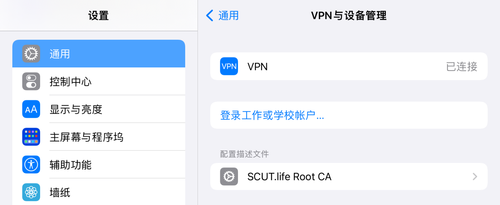
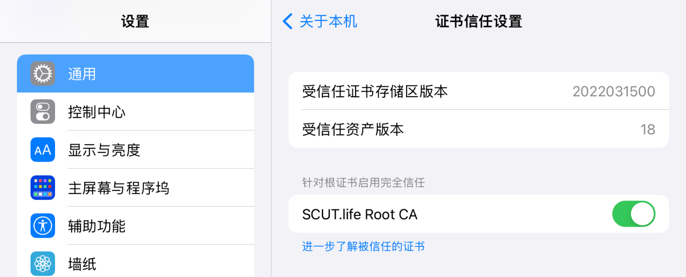
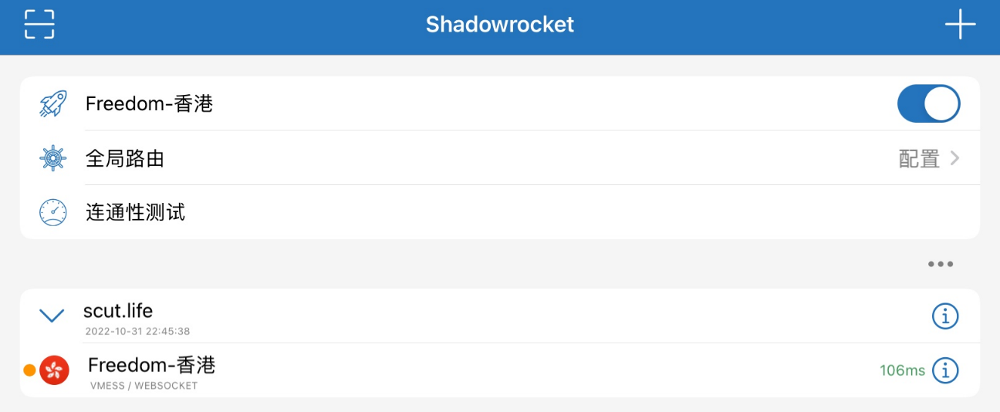
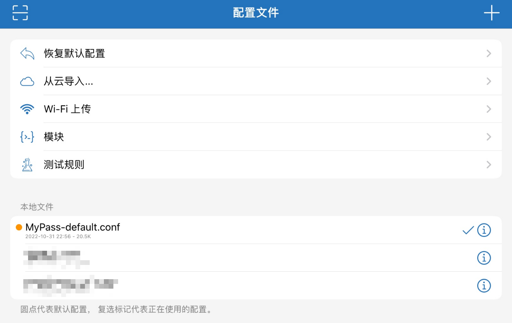

# iOS / iPadOS

## Step1. 安装 CA 证书

### Step1.1. 获取 CA 证书

前往 [下载页面](/download/) 获取 CA 证书，点击适用于 iOS / iPadOS 的 CRT 格式证书。

### Step1.2. 安装 CA 证书

1. 在弹出的对话框中点击“允许”
2. 点击“关闭”
3. 打开设置应用，找到通用—VPN与设备管理
4. 点击刚才下载的描述文件
5. 点击右上角的“安装”并输入密码
6. 点击右上角的“安装”
7. 点击右上角的“完成”



8. 进入通用—关于本机—证书信任设置
9. 打开“SCUT.life Root CA”的开关
10. 点击“继续”



## Step2. 安装代理软件

请使用美区 AppID 从 App Store 下载 ShadowRocket.

本站不提供美区 AppID，请自行获取。

::: danger 危险
请不要使用美区 AppID 登录 iCloud，否则可能造成锁机。只需要登录 App Store 即可。
:::

## Step3. 导入代理

### Step3.1. 导入服务器

1. 在首页点击右上角的加号
2. 将类型改为“Subscribe”
3. 在 URL 中填入```https://scut.life/sub/clash```
4. 点击右上角的“完成”
5. 选中“Freedom-香港”服务器
6. 启动上方的代理开关开启 VPN



### Step3.2. 导入规则

1. 点击下方的“配置”
2. 点击右上角的加号
3. 在 URL 中填入```https://scut.life/sub/MyPass-default.conf```
4. 点击“下载”
5. 点击下方远程文件中刚才导入的配置
6. 点击“使用配置”



::: warning 警告
默认情况下，SCUT.life 会使用“配置”，这就足够了。请不要修改为“代理”。
:::

## Step4. 修改信息

完成上述步骤后，打开微信 — 通讯录 — 华南理工大学 — My Pass 我的通行证。

如果配置成功，您将看到 SCUT.life 版本的 MyPass.

点击最下方的标题“健康信息”（这其实是个按钮），打开新页面后填入正确的信息。
