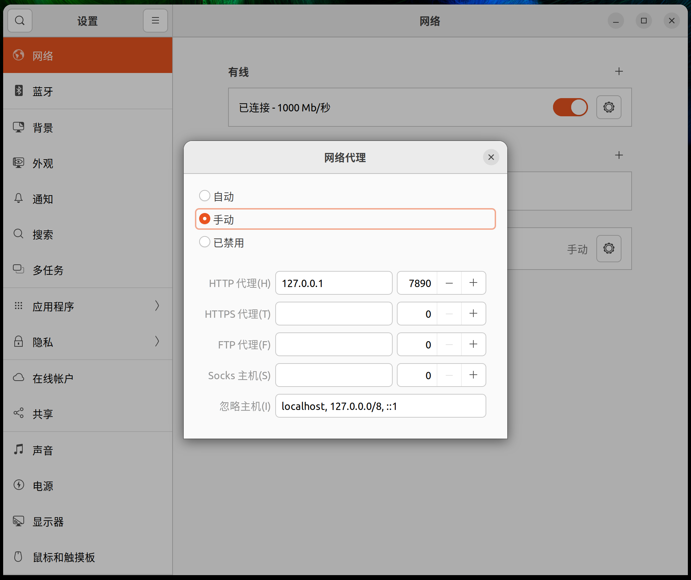

# Linux

您将通过这篇文档了解如何在 Linux 设备上使用 SCUT.life 的 MyPass.

::: tip 疑惑
真的会有人把 Linux 电脑作为通行证展示给保安吗
:::

## Step1. 安装 CA 证书

### Step1.1. 获取 CA 证书

前往 [下载页面](/download/) 获取 CA 证书。

```bash
wget https://download.scut.life/scut.edu.cn_ca.cer
```

### Step1.2. 安装 CA 证书

以 Ubuntu 为例

```bash
# 将证书复制到/usr/local/share/ca-certificates/目录
sudo cp scut.edu.cn_ca.cer /usr/local/share/ca-certificates/scut.edu.cn_ca.cer
sudo update-ca-certificates
```

## Step2. 安装代理软件

前往 [下载页面](/download/) 获取用于 Linux 的代理软件 Clash.

```bash
wget -O clash.gz "https://download.scut.life/clash-linux-amd64-v3-v1.11.8.gz"
gzip -d ./clash.gz
chmod +x ./clash
```

## Step3. 导入代理

1. 下载代理配置文件并启动代理

```bash
wget -O config.yaml "https://scut.life/sub/clash"
./clash -d .
```

2. 将系统代理设置为 http://127.0.0.1:7890



::: warning 警告
默认情况下，SCUT.life 会使用 Rule 代理，这就足够了。请不要修改为 Global 代理。
:::

## Step4. 修改信息

完成上述步骤后，打开微信 — 通讯录 — 华南理工大学 — My Pass 我的通行证。

如果配置成功，您将看到 SCUT.life 版本的 MyPass.

点击最下方的标题“健康信息”（这其实是个按钮），打开新页面后填入正确的信息。