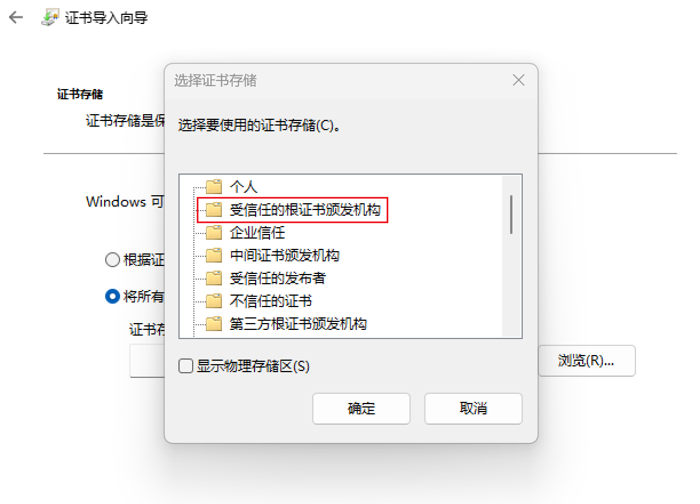
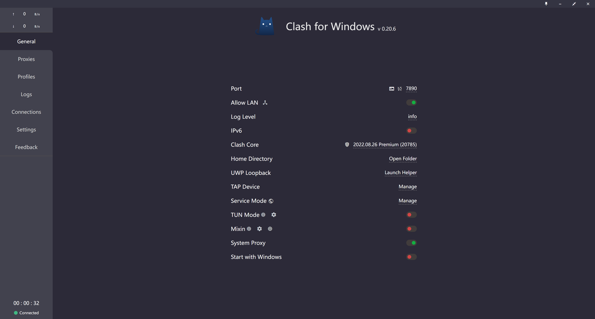

# Windows

您将通过这篇文档了解如何在 Windows 设备上使用 SCUT.life 的 MyPass.

::: tip 疑惑
真的会有人把 Windows 电脑作为通行证展示给保安吗
:::

## Step1. 安装 CA 证书

### Step1.1. 获取 CA 证书

前往 [下载页面](/download/) 获取 CA 证书。

### Step1.2. 安装 CA 证书

1. 双击打开刚才下载好的 CA 证书
2. 点击“安装证书”
3. 将存储位置改为“本地计算机”
4. 点击“下一页”，可能需要管理员权限
5. 选择“将所有的证书都放入下列存储”
6. 点击“浏览”
7. 选择“受信任的根证书颁发机构”并确定



8. 点击“下一页”

9. 点击“完成”

## Step2. 安装代理软件

前往 [下载页面](/download/) 获取用于 Windows 的代理软件 Clash For Windows.

在浏览器的下载页面中，直接打开下载好的软件并进行安装。

安装完成后，请打开 Clash 软件。



## Step3. 导入代理

1. 打开 Clash 并点击“Profiles”
2. 在上方输入框中填入```https://scut.life/sub/clash```
3. 点击 Download 按钮
4. 选中刚才创建好的配置
5. 切换到“General”页面
6. 打开“System Proxy”以开启代理

::: warning 警告
默认情况下，SCUT.life 会使用 Rule 代理，这就足够了。请不要修改为 Global 代理。
:::

## Step4. 修改信息

完成上述步骤后，打开微信 — 通讯录 — 华南理工大学 — My Pass 我的通行证。

如果配置成功，您将看到 SCUT.life 版本的 MyPass.

点击最下方的标题“健康信息”（这其实是个按钮），打开新页面后填入正确的信息。
